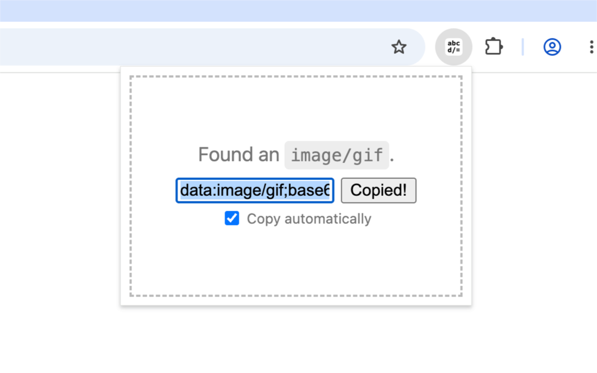

# Data URL Converter Tool

[](https://chromewebstore.google.com/detail/data-url-converter-tool/mdocclmdobfpmpcgfafgipimlppdmgff)
[](https://microsoftedge.microsoft.com/addons/detail/data-url-converter-tool/enfnkookpjkjeljjkppmbaeccigjlolk)
[](https://addons.mozilla.org/en-US/firefox/addon/data-url-converter-tool/)

A minimalist browser extension that allows you to convert files in your clipboard to data: URLs. The conversion is 100% private and happens right inside your browser.

## Download

Download the extension from the official marketplace listings:

- [Download on the Chrome Web Store](https://chromewebstore.google.com/detail/speed-changer/albfdjflebpipkmmpjblndlcjljidlei)
- [Download on Microsoft Edge Add-ons](https://microsoftedge.microsoft.com/addons/detail/speed-changer/ijgigneidepmehkbcmldmoipalfgmmbg)
- [Download on Firefox Add-ons](https://addons.mozilla.org/en-US/firefox/addon/data-url-converter-tool/)

## Running or Building Locally

To run the extension in dev mode, run the following command:

```sh
npm start
```

To build the extension, run the following command, picking one of the build targets in the curly braces:

```sh
npm run build:{chromium,edge,gecko}
```

## License

This project is licensed under the [MIT license](https://opensource.org/license/MIT).
